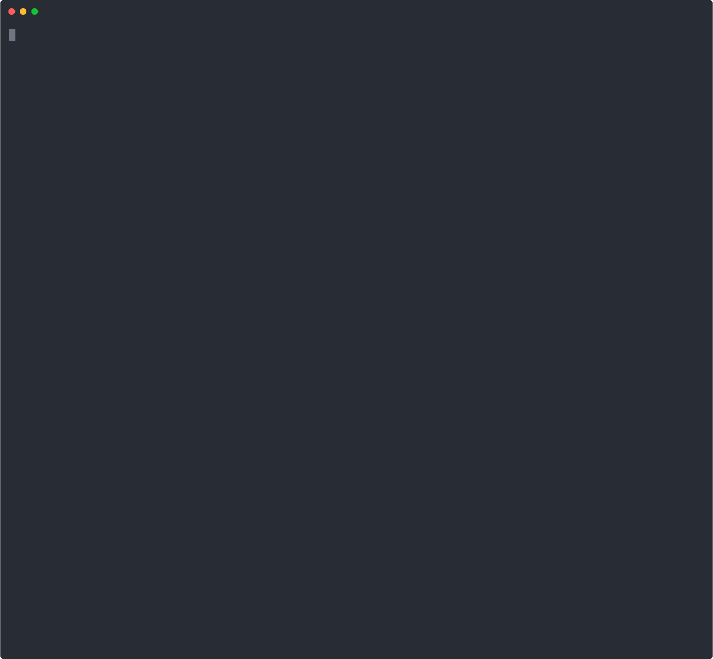

# Available console commands

## 🛠️ Makefile

To run commands through Docker we use Makefile. To see all available commands run:

```bash
$ make help
```



### → Makefile Reference

```
make                       Prepares and spins up project with default settings
make help                  Show this menu
make env                   Generate .env file from example, use `make env force=true`, to force re-create file
make i                     Install dependencies
make install               Same as `make i`
make update                Run pnpm to packages to their latest version based on the specified range
make build                 Build all apps inside monorepo
make purge                 Stops container and deletes node modules and temporary files
make deps-check            Check for outdated dependencies
make deps-update           Check for outdated dependencies and automatically update them using pnpm
make up                    Spin up this project using docker
make down                  Stops and removes all project containers
make restart               Removes containers and stops, then starts new instances
make clean                 Stops and removes docker containers, specified int docker-compose.yml
make ps                    Show running containers
make logs                  Show all project docker logs
make ssh                   Login into running app container
make recreate              Delete dependencies and re-create docker container
make pull                  Pull latest docker image from docker hub for app container
make lint                  Run lint task to fix issues
make lint-staged           Lint staged files
make commitlint            Run commitlint to check commit message
make lint-md               Lint markdown files
make lint-html             Lint html files
make lint-css              Lint css files
make lint-secrets          Check if there are any missed secret credentials in code
make test                  Run unit tests
make format                Run prettier formatting
make sort                  Sort package.json across project
make analyze               Run bundle-analyzer
make cs                    Run changeset to generate changelog
make cs-release            Publish new version to npm
make hooks                 Install git hooks from husky
```

## 📦 Package.json

To get list of available scripts to run, execute `pnpm run` in your terminal:

```bash
$ pnpm run
```

or check [package.json](https://github.com/wayofdev/next-starter-tpl/blob/master/package.json) file.
