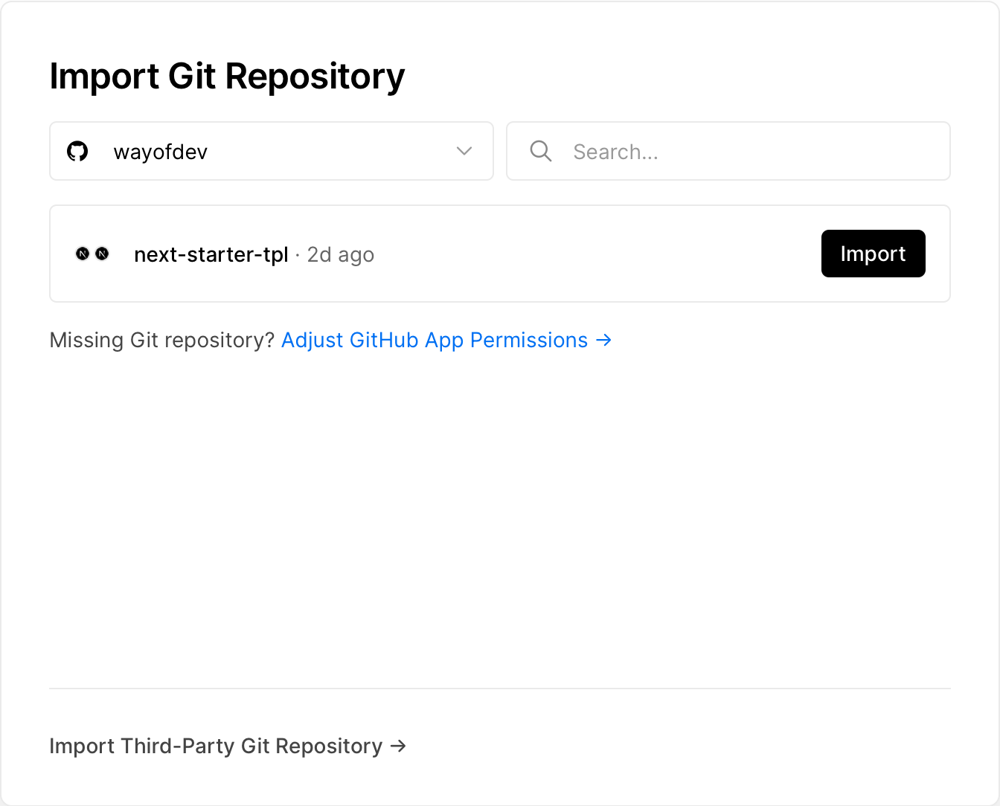
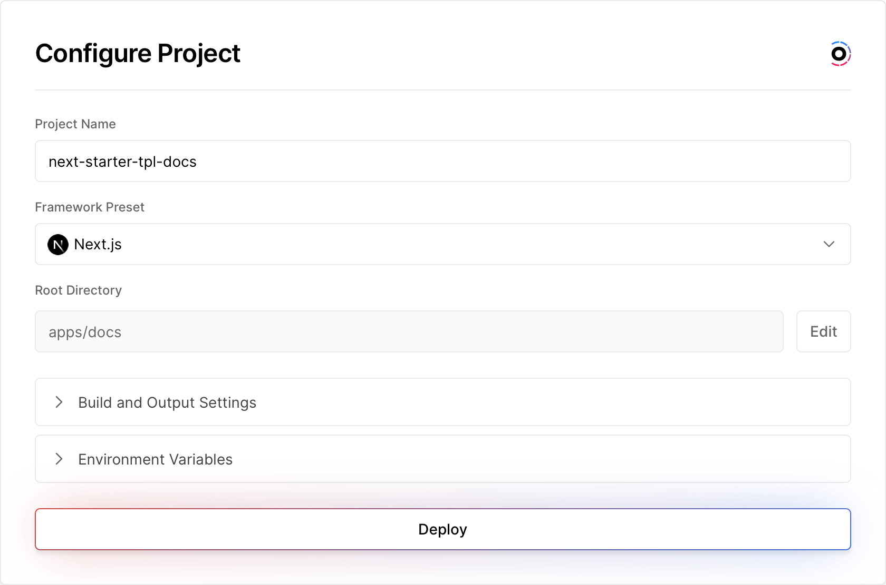

import { Callout } from 'nextra-theme-docs'

## 🐳 Docker

We use our underlying [docker-node](https://github.com/wayofdev/docker-node) image as a base for our Dockerfile. This image is based on the official [node](https://hub.docker.com/_/node) image and adds some extra tools, like **turbo** and **pnpm**, to make it easier to work with our Docker images.

Commands, that are executed through [Makefile](https://github.com/wayofdev/next-starter-tpl/blob/master/Makefile) use the [docker-compose.yaml](https://github.com/wayofdev/next-starter-tpl/blob/master/docker-compose.yaml) to run the commands inside the container. This way we can make sure that the commands are executed in the same environment, no matter if you are on Windows, Mac or Linux.

Check out help command for more information:

```bash
$ make help
```

## 🤖 Vercel, as hosting provider

Vercel supports it natively, so there's nothing to do. Just add your project to Vercel, and it will automatically detect the monorepo structure and deploy all the projects.

<Callout type="warning">
  Github repository should be already generated from our
  [next-starter-tpl](https://github.com/wayofdev/next-starter-tpl) template, before proceeding.
  Follow
  [getting-started](https://tpl-docs.wod.docker/guide/getting-started#-quick-start-from-template)
  guide to create a new project from the template.
</Callout>

<div className="steps-container">

### → Add New Project

From your vercel dashboard, click on "Add New..." and select the type — `Project`

### → Import Git Repository

Select your organization, or username, and then select the repository you want to deploy.
If you selected to create your project from github template:



### → Add `web` and `docs` applications separately:

**Docs App:**

- Project Name: **next-starter-tpl-docs**
- Framework Preset: **Next.js**
- Root Directory: **apps/docs**
- Include source files outside of the Root Directory in the Build Step: **true**

**Web App:**

- Project Name: **next-starter-tpl-web**
- Framework Preset: **Next.js**
- Root Directory: **apps/web**
- Include source files outside of the Root Directory in the Build Step: **true**



</div>
