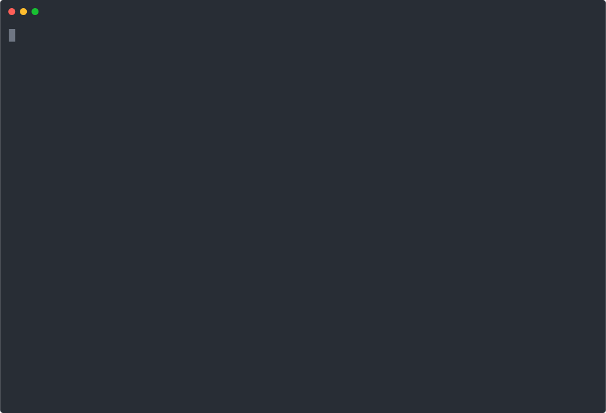

import { Tab, Tabs } from 'nextra-theme-docs'

# Linting and Formatting Code

## 📄 About

Linting is the process of running a program that will analyse code for potential errors. In the case of JavaScript,
it’s incredibly useful for spotting little things that you might otherwise miss, such as using a variable before it’s been defined,
using an out-of-scope variable, and passing the wrong number of arguments to a function.

#### running

```bash
# run all linters, through docker
$ make lint

# run all linters, locally
$ pnpm lint
```

For more information, see the `Makefile` and `package.json` in root directory of the repository.

## 🛠️ Linters and Code Quality Tools

### → Lint-staged

[Lint-staged](https://github.com/okonet/lint-staged) is a tool that allows you to run linters on Git staged files. This means that only the files you’ve changed will be linted.
Used together with [Husky](https://github.com/typicode/husky), it can prevent bad code from being committed and pushed.

#### how it works



#### running

```bash
# just do git commit and it will run the linter
$ git commit -am "fix: something"

# or you can run it manually
$ pnpm lint:staged
```

#### config structure

```bash
.
├── apps
│   ├── docs
│   │   ├── .eslintrc.js
│   │   └── lint-staged.config.js   # overwrite global lint-staged.config.js, custom eslint
│   └── web
│       ├── .eslintrc.js
│       └── lint-staged.config.js   # overwrite global lint-staged.config.js, custom eslint
│
├── packages
│   └── ui
│       ├── .eslintrc.js
│       └── lint-staged.config.js   # overwrite global lint-staged.config.js, custom eslint
│
├── lint-staged.common.js  # few common utils
└── lint-staged.config.js  # base config to overwrite per apps/packages
```

### → Commitlint

[Commitlint](https://commitlint.js.org/#/) is a tool that checks if your commit messages meet the [conventional commit](https://www.conventionalcommits.org/en/v1.0.0) format. It’s used in conjunction with [Husky](https://github.com/typicode/husky) to ensure that your commit messages are in the correct format before you push them.

We also use conventional commit to [generate changelog]() automatically. Check [Contributing]() section for more details.

#### how it works


#### running

Commitlint will run automatically when you commit your code, no actions required.

We are using our own, shared config, installed as npm dependency - [@wayofdev/commitlint-config](https://www.npmjs.com/package/@wayofdev/commitlint-config)

#### config structure

```bash
.
└── commitlint.config.js  # config extends @wayofdev/commitlint-config
```

### → Stylelint

[Stylelint](https://stylelint.io) is linter that helps you avoid errors and enforce conventions in your styles. It’s especially useful when you’re using a preprocessor, like Sass or Less, and want to ensure that your compiled CSS follows a certain standard. Configuration is shared from our [@wayofdev/stylelint-config](https://www.npmjs.com/package/@wayofdev/stylelint-config) package.

#### running

<Tabs items={['docker', 'pnpm']}>
  <Tab>
    through docker

    ```bash
    $ make lint-css
    ```

  </Tab>
  <Tab>
    directly, using system's pnpm binary

    ```bash
    $ pnpm lint:css
    ```

  </Tab>
</Tabs>

#### config structure

```bash
.
└── .stylelintrc.js  # config extends @wayofdev/stylelint-config
```

### → Secretlint

[Secretlint](https://github.com/secretlint/secretlint) is a linter that helps you avoid committing secrets and credentials into git repositories. Configuration is shared from our [@wayofdev/secretlint-config](https://www.npmjs.com/package/@wayofdev/secretlint-config) package.

#### running

<Tabs items={['docker', 'pnpm']}>
  <Tab>
    through docker

    ```bash
    $ make lint-secrets
    ```

  </Tab>
  <Tab>
    directly, using system's pnpm binary

    ```bash
    $ pnpm lint:secrets
    ```

  </Tab>
</Tabs>

#### config structure

```bash
.
├── apps
│   ├── docs
│   │   └── .secretlintignore
│   └── web
│       └── .secretlintignore
│
└── .secretlintrc.js  # config extends @wayofdev/secretlint-config
```

### → Eslint

[Eslint](https://eslint.org) is a tool for identifying and reporting on patterns found in ECMAScript/JavaScript code, with the goal of making code more consistent and avoiding bugs. In many ways, it is similar to JSLint and JSHint with a few exceptions.

#### running

<Tabs items={['docker', 'pnpm']}>
  <Tab>
    through docker, with `--fix` option enabled

    ```bash
    $ make lint
    ```

  </Tab>
  <Tab>
    or directly

    ```bash
    $ pnpm lint:turbo
    ```

    with `--fix` option enabled

    ```bash
    $ pnpm lint:turbo -- --fix
    ```

  </Tab>
</Tabs>

#### config structure

```bash
.
├── apps
│   ├── docs
│   │   └── .eslintrc.js  # extends base, enables mdx support
│   └── web
│       └── .eslintrc.js
│
└── packages
    ├── common-i18n
    │   └── .eslintrc.js
    ├── eslint-config-custom  # eslint config bases, shared across all workspaces
    │   └── .eslintrc.js
    └── ui
        └── .eslintrc.js
```

### → Prettier

[Prettier](https://prettier.io) is used to format code. It’s an opinionated code formatter that enforces a consistent style by parsing your code and re-printing it with its own rules that take the maximum line length into account, wrapping code when necessary.

Enabled by default in `packages/eslint-config-custom` and is shared across all workspaces.

### → Sort-package-json

[Sort-package-json](https://github.com/keithamus/sort-package-json) is used to sort package.json file. It’s a package.json formatter that enforces a consistent style by parsing your package.json and re-printing it with its own rules based on the well-known package.json keys order.

### running

<Tabs items={['docker', 'pnpm']}>
  <Tab>
    through docker

    ```bash
    $ make sort
    ```

  </Tab>
  <Tab>
    or directly

    ```bash
    $ pnpm lint:package-json
    ```

  </Tab>
</Tabs>

### → Htmlhint

[Htmlhint](https://github.com/htmlhint/HTMLHint) is used to lint html files. It’s a static code analysis tool for identifying problematic patterns found in HTML code.

#### running

<Tabs items={['docker', 'pnpm']}>
  <Tab>
    through docker

    ```bash
    $ make lint-html
    ```

  </Tab>
  <Tab>
    or directly

    ```bash
    $ pnpm lint:html
    ```

  </Tab>
</Tabs>

#### config structure

`lint:html` command uses config, located in `./node_modules/@wayofdev/htmlhint-config/index.json` and is shared across all workspaces.

Npm package with config is hosted on [npmjs.com](https://www.npmjs.com/package/@wayofdev/htmlhint-config) as `@wayofdev/htmlhint-config`.

### → Es-check

[Es-check](https://github.com/yowainwright/es-check) checks the version of ES in JavaScript files with simple shell commands.

#### running

<Tabs items={['docker', 'pnpm']}>
  <Tab>
    through docker

    ```bash
    $ make lint-dist
    ```

  </Tab>
  <Tab>
    or directly

    ```bash
    $ pnpm lint:dist
    ```

  </Tab>
</Tabs>

#### config structure

```bash
.
└── apps
    ├── docs
    │   └── .escheckrc
    └── web
        └── .escheckrc
```

### → Markdownlint

[Markdownlint](https://github.com/DavidAnson/markdownlint) is used to lint markdown files. It’s a Node.js style checker and lint tool for Markdown/CommonMark files. We are using our own, shared config, installed as npm dependency - [@wayofdev/markdownlint-config](https://www.npmjs.com/package/@wayofdev/markdownlint-config) and root config extends it.

#### running

<Tabs items={['docker', 'pnpm']}>
  <Tab>
    through docker

    ```bash
    $ make lint-md
    ```

  </Tab>
  <Tab>
    or directly

    ```bash
    $ pnpm lint:md
    ```

  </Tab>
</Tabs>

#### config structure

```bash
.
└── .markdownlint.json  # config extends @wayofdev/markdownlint-config
```

### → Bundle-analyzer

[Bundle-analyzer](https://www.npmjs.com/package/@next/bundle-analyzer) is used to analyze bundle size. It’s a tool that represents the size of your webpack bundle as a convenient interactive zoomable treemap.

#### running

<Tabs items={['docker', 'pnpm']}>
  <Tab>
    through docker

    ```bash
    $ make analyze
    ```

  </Tab>
  <Tab>
    or directly

    ```bash
    $ pnpm analyze
    ```

  </Tab>
</Tabs>

### → Npm-check-updates

[Npm-check-updates](https://github.com/raineorshine/npm-check-updates) is used to check for outdated dependencies. It’s a tool that allows you to upgrade your `package.json` dependencies to the latest versions, regardless of existing version constraints.

#### how it works

[](https://asciinema.org/a/Fs0w1jrNWfYUZJhvMPd4Qx0Mg)

#### running

<Tabs items={['docker', 'pnpm']}>
  <Tab>
    through docker — only check updates

    ```bash
    $ make deps-check
    ```

    check and run auto update

    ```bash
    $ make deps-update
    ```

  </Tab>
  <Tab>
    or directly, via system's pnpm — only check updates

    ```bash
    $ pnpm deps:check
    ```

    check and run auto update

    ```bash
    $ pnpm deps:update
    ```

  </Tab>
</Tabs>
